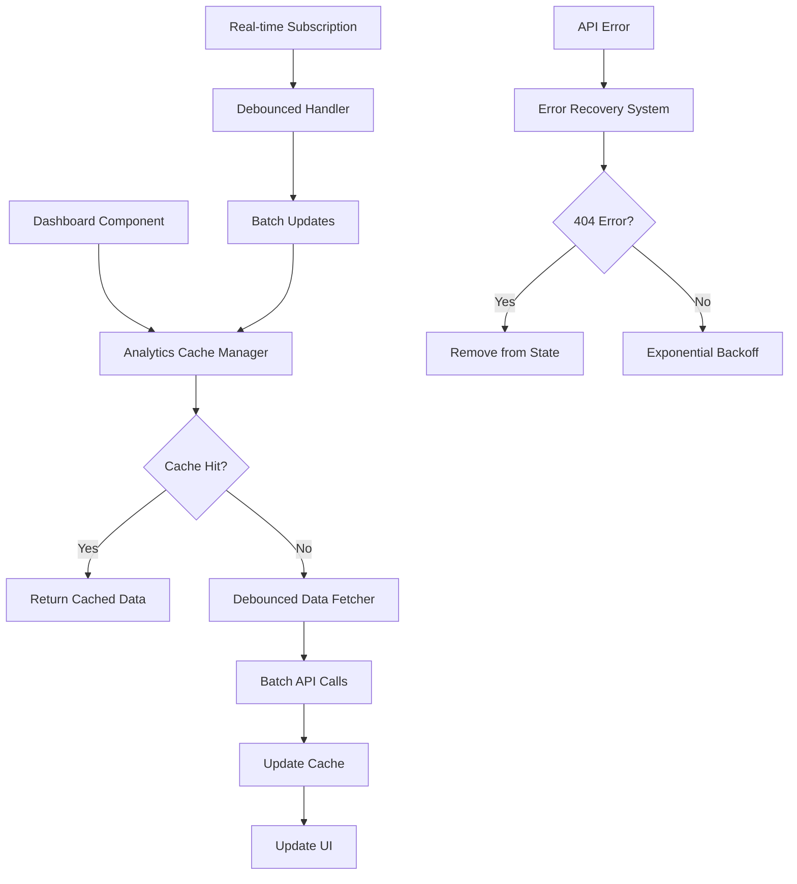

# Design Document

## Overview

This design addresses critical performance issues in the analytics system by implementing caching strategies, debouncing mechanisms, error handling improvements, and optimized data fetching patterns. The solution focuses on reducing redundant API calls, improving real-time subscription efficiency, and providing better user feedback.

## Architecture

### Core Components

1. **Analytics Cache Manager** - Centralized caching system for metrics and stats
2. **Debounced Real-time Handler** - Batches and throttles real-time updates
3. **Error Recovery System** - Handles 404s and implements retry logic
4. **Optimized Data Fetcher** - Batch API calls and pagination
5. **UI State Manager** - Loading states and user feedback

### Data Flow



## Components and Interfaces

### 1. Analytics Cache Manager

```typescript
interface AnalyticsCacheManager {
  // Cache operations
  get<T>(key: string): T | null
  set<T>(key: string, data: T, ttl?: number): void
  invalidate(key: string): void
  clear(): void
  
  // Batch operations
  getMultiple<T>(keys: string[]): Record<string, T | null>
  setMultiple<T>(entries: Record<string, T>, ttl?: number): void
  
  // Cache status
  isStale(key: string): boolean
  getLastUpdate(key: string): Date | null
}

interface CacheConfig {
  defaultTTL: number // 5 seconds
  maxSize: number    // 100 entries
  staleWhileRevalidate: boolean
}
```

### 2. Debounced Real-time Handler

```typescript
interface DebouncedRealtimeHandler {
  // Subscription management
  subscribe(channel: string, callback: (data: any) => void): void
  unsubscribe(channel: string): void
  
  // Batching configuration
  setBatchInterval(ms: number): void
  setMaxBatchSize(size: number): void
  
  // Status
  isConnected(): boolean
  getLastUpdate(): Date
  pause(): void
  resume(): void
}

interface BatchUpdate {
  type: 'experiment_metrics' | 'dashboard_stats' | 'visitor_event'
  experimentId?: string
  data: any
  timestamp: Date
}
```

### 3. Error Recovery System

```typescript
interface ErrorRecoverySystem {
  // Error handling
  handleApiError(error: ApiError, context: string): Promise<void>
  shouldRetry(error: ApiError): boolean
  getRetryDelay(attemptCount: number): number
  
  // State management
  markExperimentAsNotFound(experimentId: string): void
  isExperimentMarkedAsNotFound(experimentId: string): boolean
  clearNotFoundMarkers(): void
}

interface ApiError {
  status: number
  message: string
  endpoint: string
  experimentId?: string
}
```

### 4. Optimized Data Fetcher

```typescript
interface OptimizedDataFetcher {
  // Batch operations
  fetchExperimentMetrics(experimentIds: string[]): Promise<Record<string, ExperimentMetrics>>
  fetchDashboardStats(timeRange: string): Promise<DashboardStats>
  
  // Pagination
  fetchExperimentsPaginated(page: number, limit: number): Promise<PaginatedExperiments>
  
  // Conditional requests
  fetchIfModified(endpoint: string, lastModified?: string): Promise<ApiResponse>
}

interface PaginatedExperiments {
  experiments: Experiment[]
  totalCount: number
  hasNextPage: boolean
  nextPage?: number
}
```

## Data Models

### Cache Entry Model

```typescript
interface CacheEntry<T> {
  data: T
  timestamp: Date
  ttl: number
  key: string
  stale: boolean
}
```

### Performance Metrics Model

```typescript
interface PerformanceMetrics {
  cacheHitRate: number
  avgResponseTime: number
  apiCallsReduced: number
  errorRate: number
  lastOptimizationRun: Date
}
```

### UI State Model

```typescript
interface UIState {
  loading: {
    dashboard: boolean
    experiments: Record<string, boolean>
    metrics: Record<string, boolean>
  }
  errors: {
    message: string
    type: 'network' | 'not_found' | 'permission' | 'server'
    timestamp: Date
    dismissed: boolean
  }[]
  lastUpdate: Date
  connectionStatus: 'connected' | 'disconnected' | 'reconnecting'
}
```

## Error Handling

### 404 Error Handling Strategy

1. **Immediate Response**: Remove experiment from local state
2. **Stop Further Requests**: Mark experiment as not found
3. **UI Update**: Show "Experiment no longer exists" message
4. **Cleanup**: Remove from cache and subscriptions

### Retry Logic Implementation

```typescript
const retryConfig = {
  maxAttempts: 3,
  baseDelay: 1000, // 1 second
  maxDelay: 10000, // 10 seconds
  backoffMultiplier: 2,
  retryableStatuses: [408, 429, 500, 502, 503, 504]
}
```

### Error Recovery Workflow

1. **Error Detection**: Catch API errors and classify them
2. **Immediate Handling**: Show user-friendly error message
3. **Background Recovery**: Implement retry logic for recoverable errors
4. **State Cleanup**: Remove invalid data from cache and state
5. **User Notification**: Provide manual refresh options

## Testing Strategy

### Unit Tests

1. **Cache Manager Tests**
   - Cache hit/miss scenarios
   - TTL expiration behavior
   - Memory management
   - Concurrent access handling

2. **Debouncing Tests**
   - Batch accumulation
   - Timer behavior
   - Event deduplication
   - Performance under load

3. **Error Handling Tests**
   - 404 error scenarios
   - Retry logic validation
   - Exponential backoff timing
   - State cleanup verification

### Integration Tests

1. **Real-time Subscription Tests**
   - Connection management
   - Data synchronization
   - Performance under high frequency updates
   - Error recovery scenarios

2. **API Optimization Tests**
   - Batch request efficiency
   - Cache effectiveness
   - Response time improvements
   - Memory usage optimization

### Performance Tests

1. **Load Testing**
   - Multiple concurrent users
   - High-frequency real-time updates
   - Large dataset handling
   - Memory leak detection

2. **Benchmark Tests**
   - Before/after performance comparison
   - Cache hit rate measurement
   - API call reduction metrics
   - User experience improvements

## Implementation Phases

### Phase 1: Core Caching System
- Implement AnalyticsCacheManager
- Add basic TTL and invalidation logic
- Integrate with existing hooks

### Phase 2: Debounced Real-time Updates
- Create DebouncedRealtimeHandler
- Implement batching logic
- Update subscription management

### Phase 3: Error Recovery
- Build ErrorRecoverySystem
- Add 404 handling and retry logic
- Implement user-friendly error messages

### Phase 4: Data Fetching Optimization
- Create OptimizedDataFetcher
- Implement batch API calls
- Add pagination support

### Phase 5: UI Improvements
- Add loading states and progress indicators
- Implement connection status display
- Add manual refresh capabilities

## Performance Targets

### Metrics to Achieve

1. **API Call Reduction**: 70% fewer redundant calls
2. **Cache Hit Rate**: 85% or higher
3. **Response Time**: Sub-200ms for cached data
4. **Error Recovery**: 95% success rate for retryable errors
5. **Memory Usage**: <50MB for cache storage
6. **Real-time Latency**: <2 second update batching

### Monitoring and Alerting

1. **Performance Dashboard**: Track cache hit rates and response times
2. **Error Monitoring**: Alert on high error rates or failed recoveries
3. **Resource Usage**: Monitor memory and CPU usage
4. **User Experience**: Track loading times and error frequencies