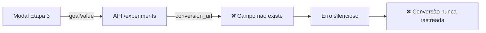
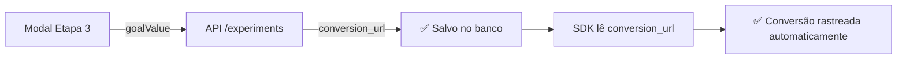

# 🔧 Instruções para Aplicar Migration de Conversões

## ❌ PROBLEMA IDENTIFICADO

A tabela `experiments` **NÃO POSSUI** os campos necessários para salvar a página de conversão:
- `conversion_url` ❌
- `conversion_type` ❌
- `conversion_value` ❌
- `target_url` ❌
- `duration_days` ❌

**Resultado:** Quando o usuário cadastra a página de conversão no modal (Etapa 3), a API tenta salvar mas **o campo não existe no banco**, causando erro silencioso e a conversão nunca é contabilizada.

## ✅ SOLUÇÃO

Foi criada a migration `/supabase/migrations/20251018000000_add_conversion_fields.sql` que adiciona todos os campos faltantes.

## 📋 COMO APLICAR A MIGRATION

### Opção 1: Via Supabase Dashboard (Recomendado)

1. Acesse o dashboard do Supabase: https://supabase.com/dashboard
2. Selecione seu projeto
3. Vá em **SQL Editor** (menu lateral esquerdo)
4. Cole o conteúdo do arquivo `/supabase/migrations/20251018000000_add_conversion_fields.sql`
5. Clique em **Run** ou pressione `Ctrl+Enter`
6. Aguarde a confirmação `✅ Todos os campos de conversão foram adicionados com sucesso!`

### Opção 2: Via Supabase CLI

```bash
# Na raiz do projeto
cd /Users/allisonnascimento/Desktop/site/rotafinal

# Aplicar migration
npx supabase db push

# Ou aplicar migration específica
npx supabase migration up --file supabase/migrations/20251018000000_add_conversion_fields.sql
```

### Opção 3: Via psql (Linha de Comando)

```bash
# Obter a connection string no Supabase Dashboard > Project Settings > Database
# Formato: postgresql://postgres:[YOUR-PASSWORD]@[HOST]:[PORT]/postgres

# Executar migration
psql "postgresql://postgres:[PASSWORD]@[HOST]:[PORT]/postgres" \
  < supabase/migrations/20251018000000_add_conversion_fields.sql
```

## ✅ VERIFICAÇÃO PÓS-MIGRATION

### 1. Verificar Campos no Dashboard

No **SQL Editor**, execute:

```sql
-- Listar todos os campos da tabela experiments
SELECT column_name, data_type, column_default
FROM information_schema.columns
WHERE table_name = 'experiments'
  AND column_name IN ('target_url', 'conversion_url', 'conversion_type', 'conversion_value', 'duration_days')
ORDER BY ordinal_position;
```

**Resultado esperado:**
```
column_name       | data_type          | column_default
------------------+-------------------+------------------
target_url        | text              | NULL
conversion_url    | text              | NULL
conversion_type   | text              | 'page_view'::text
conversion_value  | numeric           | 0.00
duration_days     | integer           | 14
```

### 2. Testar Criação de Experimento

1. Acesse o dashboard da aplicação
2. Crie um novo experimento A/B
3. Na **Etapa 3 - Meta**, preencha:
   - Tipo: "Acesso a uma página"
   - URL da página de sucesso: `https://seusite.com/obrigado`
   - Valor da Conversão: `100.00`
4. Clique em "Criar Experimento"
5. Verifique no Supabase se o campo foi salvo:

```sql
-- Verificar último experimento criado
SELECT
  id,
  name,
  target_url,
  conversion_url,
  conversion_type,
  conversion_value,
  duration_days,
  created_at
FROM experiments
ORDER BY created_at DESC
LIMIT 1;
```

**Resultado esperado:**
```
id              | [uuid]
name            | "Teste de Conversão"
target_url      | "https://seusite.com/teste"
conversion_url  | "https://seusite.com/obrigado"  ✅
conversion_type | "page_view"                      ✅
conversion_value| 100.00                           ✅
duration_days   | 14                               ✅
```

### 3. Testar Rastreamento de Conversão

1. **Obter código do experimento:**
   - Clique no experimento criado
   - Copie o código de integração

2. **Verificar código gerado:**
   - O código deve conter:
   ```javascript
   checkAndTrackConversion=function(expData){
     if(!expData||!expData.conversion_url)return;  // ✅ Deve ter conversion_url
     // ...
   }
   ```

3. **Testar em página HTML:**
   - Cole o código em uma página de teste
   - Acesse a página
   - Navegue até a URL de conversão configurada
   - Verifique os logs do console: `[RotaFinal] 🎯 Conversion page detected!`

4. **Verificar conversão no banco:**
```sql
-- Verificar eventos de conversão
SELECT
  event_type,
  properties->>'url' as page_url,
  properties->>'value' as conversion_value,
  created_at
FROM events
WHERE event_type = 'conversion'
ORDER BY created_at DESC
LIMIT 5;
```

## 🔍 TROUBLESHOOTING

### Erro: "column experiments.conversion_url does not exist"

**Causa:** Migration não foi aplicada ou falhou
**Solução:** Execute novamente a migration via Supabase Dashboard

### Conversões não estão sendo rastreadas

**Verificar:**
1. Campo `conversion_url` está preenchido no experimento? ✅
2. SDK está corretamente instalado no `<head>`? ✅
3. Console do navegador mostra logs `[RotaFinal]`? ✅
4. URL atual corresponde à `conversion_url` configurada? ✅

```sql
-- Debug: Ver configuração do experimento
SELECT
  id,
  name,
  conversion_url,
  conversion_type,
  conversion_value
FROM experiments
WHERE id = '[seu-experiment-id]';
```

### Experimentos antigos sem conversion_url

**Causa:** Experimentos criados antes da migration
**Solução:** Atualizar manualmente ou criar novos experimentos

```sql
-- Atualizar experimento existente
UPDATE experiments
SET
  conversion_url = 'https://seusite.com/obrigado',
  conversion_type = 'page_view',
  conversion_value = 100.00
WHERE id = '[experiment-id]';
```

## 📊 IMPACTO DA CORREÇÃO

### Antes da Migration ❌



### Depois da Migration ✅



## 🎯 PRÓXIMOS PASSOS

Após aplicar a migration:

1. ✅ Criar novo experimento de teste
2. ✅ Verificar se `conversion_url` é salvo
3. ✅ Copiar código de integração
4. ✅ Testar em página HTML
5. ✅ Acessar página de conversão
6. ✅ Verificar eventos no banco de dados
7. ✅ Confirmar que conversão aparece no dashboard

## 📞 Suporte

Se encontrar problemas:
1. Verifique logs do console (F12)
2. Execute queries de verificação acima
3. Verifique se migration foi aplicada com sucesso
4. Documente o erro exato para debug
